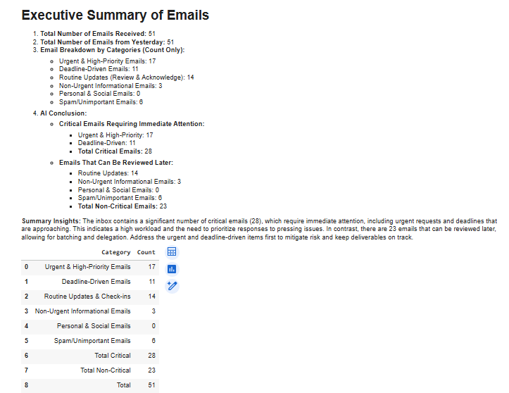
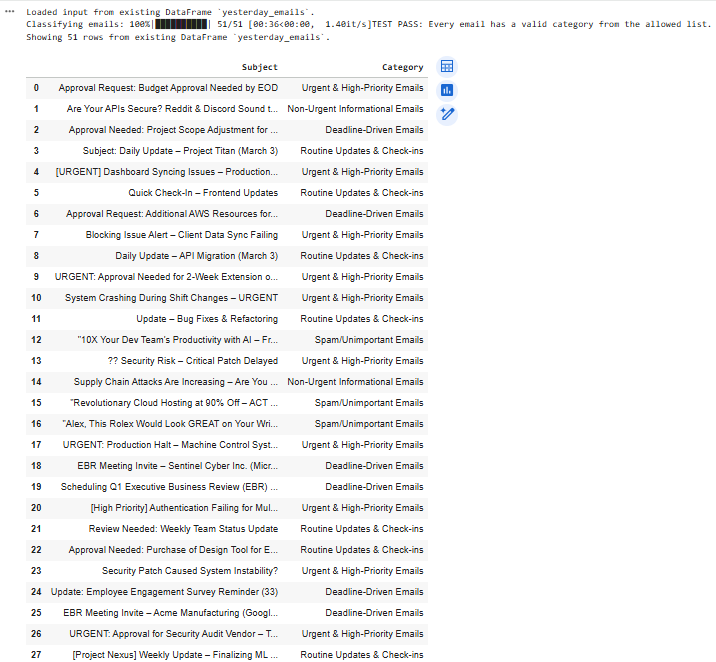
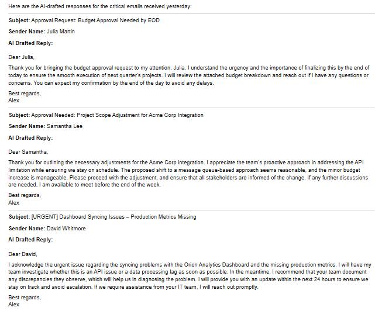

# AI Email Secretary (Yesterbox Workflow)

This project automates email triage using the Yesterbox method. It reads a daily CSV export of emails, extracts priorities, identifies urgent messages, and generates clear, actionable summaries including draft responses.

This version is designed as a professional prototype suitable for recruiters and technical reviewers.

## Features

- Detects the "yesterday" CSV based on filename  
- Cleans and structures email data  
- Identifies tasks, follow ups, requests, and deadlines  
- Flags urgent or high priority messages  
- Generates a concise Yesterbox style summary  
- Produces draft responses using email context  
- Automatically uses a sample file if no upload is provided  

## How to Run

### Option 1: Google Colab

1. Open the notebook in Google Colab.  
2. Upload your CSV or use the sample file included.  
3. Enter your OpenAI API key in the secrets cell.  
4. Run the notebook from top to bottom.

### Option 2: Run Locally

Install dependencies:

    pip install -r requirements.txt

Launch Jupyter:

    jupyter notebook

Open the notebook and run all cells.

## Repository Structure

    ai-email-secretary-yesterbox/
    ├── AI_Email_Secretary_v43_Portfolio.ipynb
    ├── requirements.txt
    ├── sample_data/
    │   └── Alex_emails_march_04.csv
    └── screenshots/
        ├── summary.png
        └── output_block.png

## Configuration

The notebook requires an `OPENAI_API_KEY`.

Set it as an environment variable:

    export OPENAI_API_KEY="your_key_here"

Or use the Colab secrets UI inside the notebook.

## Why This Project Matters

This is a practical AI workflow demonstrating:

- Python workflow automation  
- CSV and structured data processing  
- LLM based reasoning and summarization  
- Prompt engineering  
- Real world productivity automation  

Recruiters and technical reviewers can run it quickly and see meaningful output.

## Requirements

Create a `requirements.txt` file with the following contents:

    pandas
    python-dotenv
    openai
    tiktoken
    jupyter

## **Project Structure**

## Screenshots

### Summary View
A preview of the final Yesterbox-style summary generated by the notebook:

### Data Preview
A sample of the cleaned email data after CSV ingestion and preprocessing:

### AI-drafted responses.png

